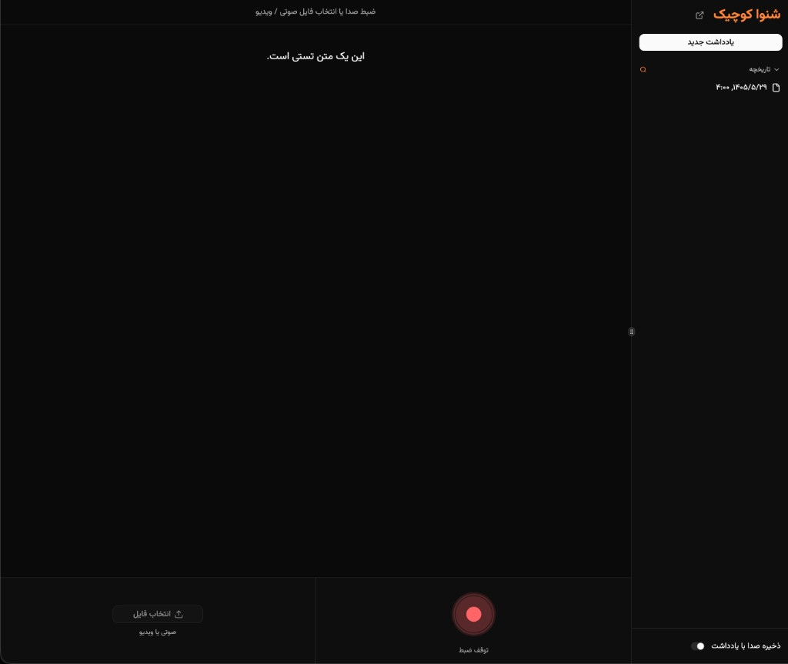
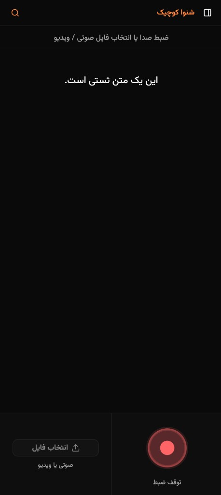

# شنوا کوچیک

یه اپ یادداشت صوتیه. به‌جای تایپ، حرف می‌زنی یا فایل صوتی / ویدیو می‌ذاری؛ متنش همون‌جا تو مرورگر نوشته می‌شه.

آفلاین هم کار می‌کنه؛ بعد از بار اول که مدل اومد، دیگه لازم نیست آنلاین باشی. صدا از دستگاهت بیرون نمی‌ره.

در اصل ساخته شده تا نشون بده مدل [شنوا کوچیک](https://huggingface.co/Reza2kn/Shenava-Koochik-v1.0) تو مرورگر چه کارهایی می‌تونه بکنه.

## اسکرین‌شات

<p>
  
</p>
<p>
  
</p>

## بالا آوردنش

کروم یا اج بهترن (WebGPU). بقیه مرورگرها هم معمولاً با WASM راه می‌افتن.

```bash
bun install
bun run download-model
bun run dev
```

آدرس لوکال رو که ترمینال چاپ می‌کنه باز کن. دستور `download-model` فایل مدل رو می‌ذاره تو `public/models` تا آفلاین هم آماده باشه. بدون اون هم اپ بالا میاد و مدل رو از هاگینگ‌فیس می‌گیره.

لایسنس MIT. خود مدل شنوا کوچیک لایسنس جدا داره؛ از صفحه‌ش روی هاگینگ‌فیس ببین.
